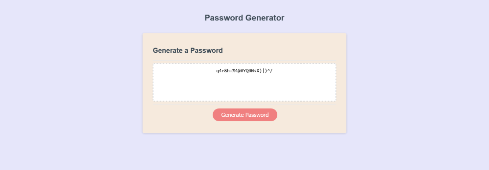

# JS-PassGen

Password Generator in Java Script

[Link to Site](https://masonmarc.github.io/JS-PassGen/)

[Link to Github Repo](https://github.com/MasonMarc/JS-PassGen)

# Table of Contents

[Descriptions](#descriptions)

[Visuals](#visuals)

[Resources](#resources)

# Descriptions

This project is a password generator using Java Script to make a password between 8-128 characters long

# Visuals

# Resources

[String Help](https://developer.mozilla.org/en-US/docs/Web/JavaScript/Reference/Global_Objects/String/split)

[Array Help](https://developer.mozilla.org/en-US/docs/Web/JavaScript/Reference/Global_Objects/Array/toString)

[for loop Help](https://www.w3schools.com/js/js_loop_for.asp)
